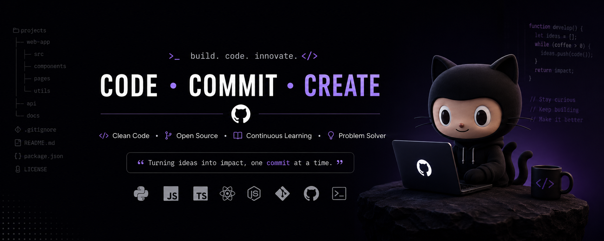

<!-- ================= HERO BANNER ================= -->

  

<h1 align="center">Hi 👋, I'm Myo Aung</h1>

<h3 align="center">
🚀 Offline-First Architect • 🤖 AI Agent Engineer • 🏢 Enterprise SaaS Builder
</h3>

Building resilient systems for unstable infrastructure + AI-powered automation platforms.

---

# 🧠 Who Am I

I design and build **mission-critical software systems** that operate reliably in real-world conditions:

- 🌐 Unstable internet environments
- ⚡ Power outages
- 📶 Low-connectivity regions
- 🏢 Large-scale enterprise operations

I combine:
> Offline-First Engineering + AI Agents + Cloud-Native Architecture

---

# 🚀 Core Focus Areas

- 🏢 Enterprise SaaS Platforms
- 🛒 POS & ERP Systems (Retail / Pharmacy / Wholesale)
- 🎓 School Management Systems (LMS)
- 🤖 AI Agents & MCP Ecosystem
- 📱 Flutter Cross-Platform Apps
- ☁️ Cloud-Native Backend Systems

---

# 🏗 Featured Projects

## 🛒 RetailOS (Flagship)

  

**Enterprise Multi-Tenant POS & ERP Platform**

- Grocery POS
- Pharmacy System
- Wholesale ERP
- Inventory & Accounting
- CRM System
- Offline Sync Engine
- Multi-Branch Support

---

## 🎓 School LMS

  

**Modern Education Management Platform**

- Student Information System
- Teacher Dashboard
- Parent Portal
- Attendance System
- Exams & Assignments
- RBAC Security
- AI Learning Assistant

---

## 🤖 AI Agent Toolkit

  

**AI Automation & MCP Ecosystem**

- Claude Code Integration
- MCP Servers
- AI Agents
- Prompt Engineering Toolkit
- RAG Pipelines
- Workflow Automation

---

# 🧠 Architecture Philosophy

  

I build systems based on real-world constraints:

✔ Offline-First Design  
✔ Domain-Driven Design (DDD)  
✔ Clean Architecture  
✔ Event-Driven Systems  
✔ Modular Monoliths  
✔ Microservices (when needed)  
✔ Fault Tolerant Systems  
✔ Scalable SaaS Platforms  

---

# 🛠 Tech Stack

## 📱 Mobile

## 🖥 Backend

## ☁️ Cloud & DevOps

## 🤖 AI Stack

---

# 🏆 Certifications

  
  

  
  

---

# 📊 GitHub Analytics

---

# 🌍 Connect With Me

- 🌐 Website: https://www.cosmicforgemm.com  
- 💼 LinkedIn: https://linkedin.com/in/myoaung21  
- 📧 Email: myoaung21@gmail.com  

---

# 💬 Philosophy

> "Great software is not about code — it is about resilience, impact, and solving real-world constraints."

---

⭐ If you like my work, consider following or starring a repository ⭐

